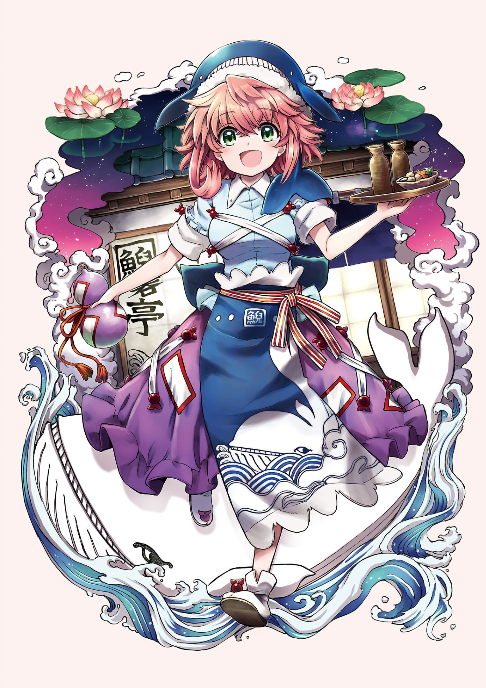

Бармен, повар и хостесс ресторана ["Гейдонтей"](../Локации/"Гейдонтей".md).
*"За прилавком вы замечете девушку. Зелёные глаза, окружённые короткими розовыми волосами, полностью сконцентрированны на тёмном пятне, расплывшимся по отполированной до блеска прилавке, которое она яростно оттирает тряпкой. Она носит светло-голубую рубашку и длинную пурпурную юбку, узор на которой напоминет талисманы оммёдо, поверх которого она носит синий фартук с изображением кита, плывущего в волнах, и шапку в виде синего кита. После очередной яросной попытки вывести пятно, она удовлетворённо кивает про себя, и её взгляд поднимется на вас."*
